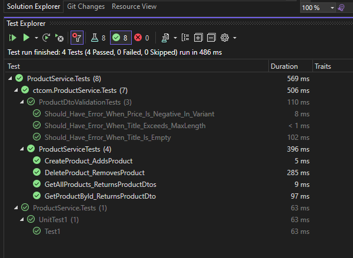

# ctcom.product-service

# Product Microservice

## Overview

The **Product Microservice** is part of the `ctcom` platform and handles product-related operations such as creating, updating, deleting, and retrieving products. It follows a microservice architecture with Event-Driven Architecture (EDA) principles using Kafka (or RabbitMQ) for event messaging.

This service is built using **.NET 8 Web API**, adhering to **SOLID principles** and ensuring scalability, separation of concerns, and ease of maintenance.

## Features

- **CRUD Operations**: Create, Read, Update, and Delete products.
- **Event Publishing**: Events such as `ProductCreated`, `ProductUpdated`, and `ProductDeleted` are published using Kafka/RabbitMQ.
- **Decoupled Design**: Follows SOLID principles, ensuring a clean and maintainable codebase.
- **In-memory Data Store**: Currently using an in-memory list for product data storage. You can integrate with a persistent database (e.g., SQL Server, MongoDB).

## Technology Stack

- **.NET 8 Web API**
- **Dependency Injection**
- **Docker** (for containerization)
- **Polly** (for resilience and retry logic)
- **RabbitMQ** (for message/event handling)
- **MassTransit** (for managing RabbitMQ)

---


### Last Feature: Product Model with Variants and Options

The **ProductService** has been enhanced to support product variants, options, and images, similar to MedusaJS. The updated product model includes:

* **Product Variants** : Each product can have multiple variants (e.g., different sizes or colors).
* **Product Options** : Options (like size, color) define the variations in product variants.
* **Product Images** : Products can have multiple associated images.

This feature allows the product model to better represent complex product structures, including variants and options, which is useful for multi-seller or e-commerce platforms.

### Transient Error Resilience

Transient error resilience has been added to the database connection configuration to handle temporary connection failures. The `EnableRetryOnFailure` option has been applied to automatically retry failed database operations, improving the reliability of the system in cases of intermittent database connectivity issues.

---


## Endpoints

### Base URL: `/api/products`

| HTTP Method | Endpoint       | Description                |
| ----------- | -------------- | -------------------------- |
| GET         | `/`          | Retrieve all products      |
| GET         | `/{id:guid}` | Retrieve a product by ID   |
| POST        | `/`          | Create a new product       |
| PUT         | `/{id:guid}` | Update an existing product |
| DELETE      | `/{id:guid}` | Delete a product by ID     |

### Sample Request Payloads

#### Create Product (POST `/api/products`)

```json
{
  "name": "Sample Product",
  "description": "This is a sample product.",
  "price": 99.99,
  "stock": 100
}
```

### Adding Unit Tests

Unit tests have been added to ensure the correctness of the `ProductService` and its interaction with the repository and AutoMapper. These tests are located in a separate test project to maintain a clear separation between production and test code.

#### Running the Tests

To run the tests, navigate to the solution folder and use the following command:

```
dotnet test
```


The test project includes unit tests for:

* CRUD operations of the `ProductService`
* Validation rules using FluentValidation
* Mapping between models and DTOs using AutoMapper

The tests are designed to mock dependencies like the repository and use an in-memory database to ensure the service logic works as expected.




## structure

ctcom.ProductService
│
├── Controllers
│   └── ProductController.cs                # Handles API endpoints for Product operations
│
├── DTOs                                    # Data Transfer Objects for API communication
│   └── ProductDto.cs
│   └── ProductVariantDto.cs
│   └── ProductOptionDto.cs
│   └── ProductOptionValueDto.cs
│   └── ProductImageDto.cs
│
├── DTOs/Validation                         # Validation classes using FluentValidation
│   └── ProductDtoValidator.cs
│   └── ProductVariantDtoValidator.cs
│   └── ProductOptionDtoValidator.cs
│
├── Models                                  # Domain models representing business logic
│   └── Product.cs
│   └── ProductVariant.cs
│   └── ProductOption.cs
│   └── ProductOptionValue.cs
│   └── ProductImage.cs
│
├── Repositories                            # Data access layer
│   └── IProductRepository.cs
│   └── ProductRepository.cs
│
├── Services                                # Business logic layer
│   └── IProductService.cs
│   └── ProductService.cs
│
├── Mapping                                 # AutoMapper profiles for model <=> DTO mapping
│   └── ProductMappingProfile.cs
│
├── Events                                  # Event definitions for EDA
│   └── ProductCreatedEvent.cs
│   └── ProductUpdatedEvent.cs
│   └── ProductDeletedEvent.cs
│
├── Messaging                               # Messaging infrastructure (RabbitMQ/Kafka)
│   └── IMessageProducer.cs
│   └── RabbitMessageProducer.cs            # Producer implementation for RabbitMQ
│
└── Program.cs                              # Application entry point and dependency configuration


ctcom.ProductService.Tests
│
├── Services                                # Unit tests for services
│   └── ProductServiceTests.cs
│
├── Validators                              # Unit tests for validation
│   └── ProductDtoValidationTests.cs
│
└── TestHelpers
